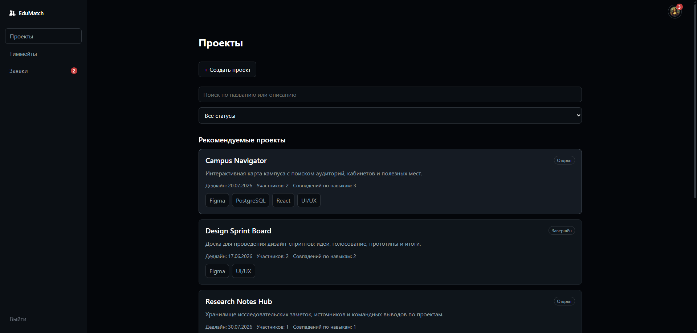
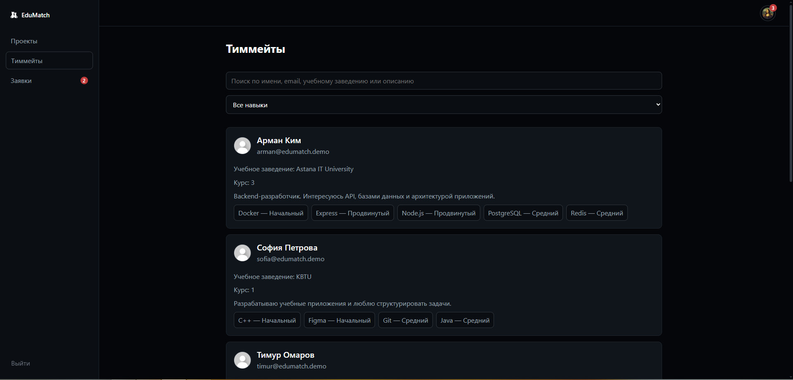
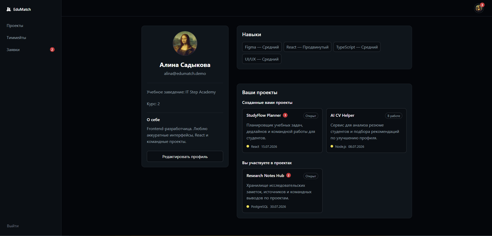
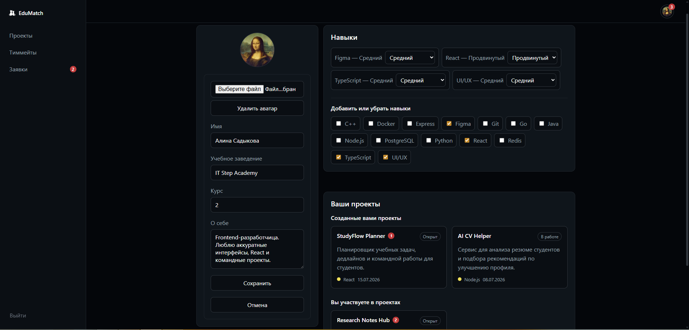
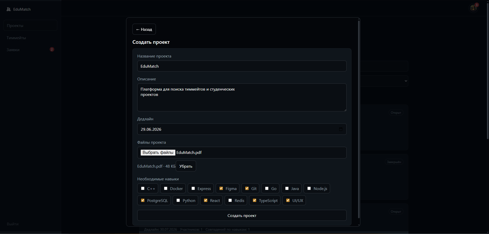
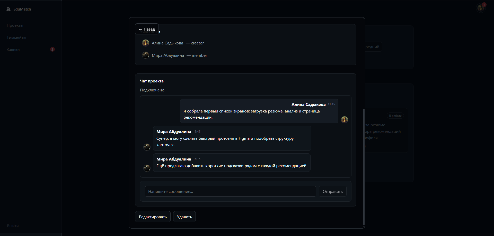
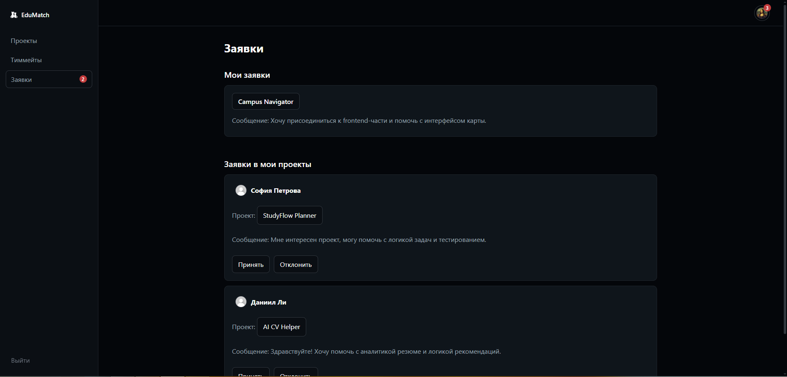
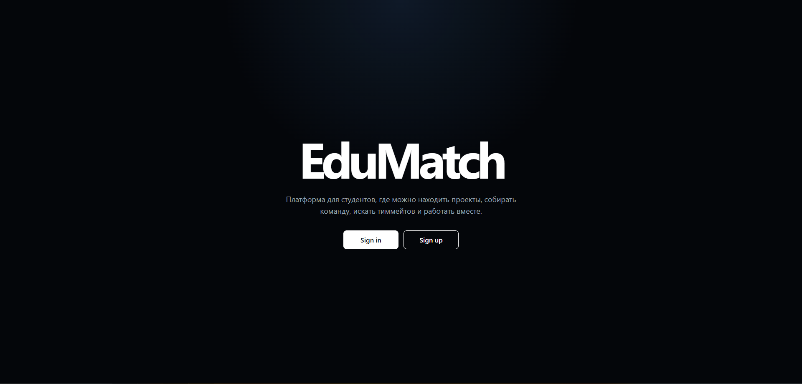
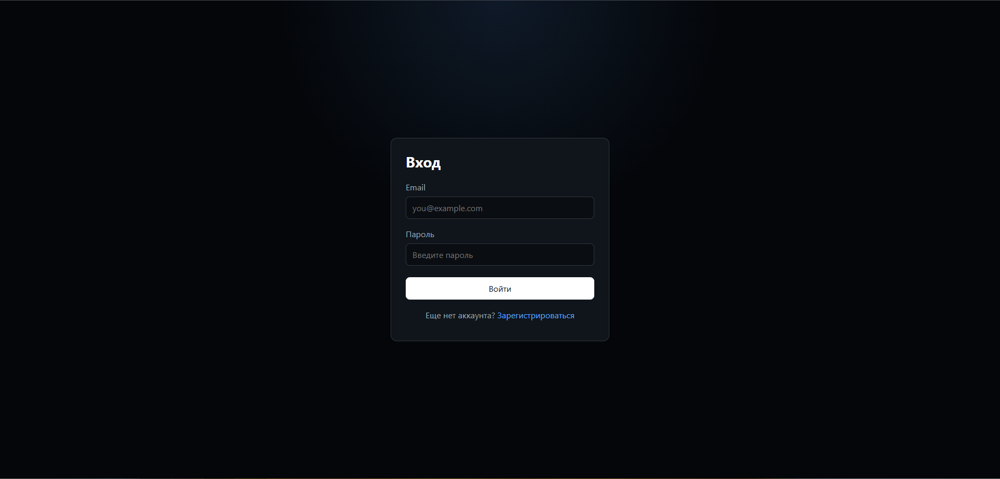
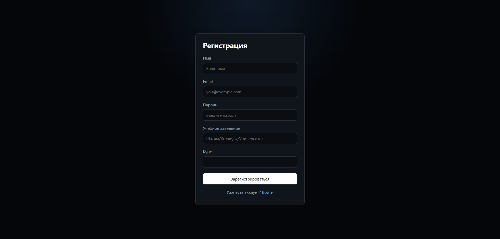

# EduMatch

Full-stack web-платформа для поиска студенческих проектов, тиммейтов и командной работы.
Сервис помогает студентам создавать проекты, находить участников по навыкам, подавать заявки в команды и общаться в проектных чатах.

## Стек

| Слой          | Технологии                                     |
| ------------- | ---------------------------------------------- |
| Frontend      | React, Vite, TypeScript, React Router, CSS     |
| Backend       | Node.js, Express, TypeScript, JWT, bcrypt, Zod |
| Database      | PostgreSQL                                     |
| Cache / infra | Redis                                          |
| Realtime      | WebSocket                                      |
| API testing   | Postman                                        |
| Design / Docs | Figma                                          |

## Быстрый старт

### 1. PostgreSQL

Создать базу данных:

```sql
CREATE DATABASE edumatch;
```

Выполнить SQL-скрипт:

```txt
database/schema.sql
```

При необходимости можно добавить демонстрационные данные:

```txt
database/seed_demo.sql
```

### 2. Redis

Redis используется как инфраструктурный сервис проекта.

Для локального запуска можно использовать локальный Redis или облачный Redis, например Upstash.

### 3. Backend

Перейти в папку сервера:

```bash
cd apps/server
```

Установить зависимости:

```bash
pnpm install
```

Создать `.env`:

```txt
PORT=3000
NODE_ENV=development
CLIENT_URL=http://localhost:5173

DATABASE_URL=your_postgresql_url
REDIS_URL=your_redis_url

JWT_ACCESS_SECRET=your_access_secret
JWT_REFRESH_SECRET=your_refresh_secret
JWT_ACCESS_EXPIRES_IN=15m
JWT_REFRESH_EXPIRES_IN=30d
```

Запустить backend:

```bash
pnpm dev
```

API:

```txt
http://localhost:3000/api
```

WebSocket:

```txt
ws://localhost:3000/ws
```

### 4. Frontend

Перейти в папку клиента:

```bash
cd apps/client
```

Установить зависимости:

```bash
pnpm install
```

Создать `.env`:

```txt
VITE_API_URL=http://localhost:3000/api
VITE_WS_URL=ws://localhost:3000/ws
```

Запустить frontend:

```bash
pnpm dev
```

Сайт:

```txt
http://localhost:5173
```

## Первый запуск

После запуска frontend можно зарегистрировать пользователя через интерфейс.

Демо-пользователи, если был выполнен demo seed:

```txt
alina@edumatch.demo
Demo12345!
```

```txt
mira@edumatch.demo
Demo12345!
```

```txt
arman@edumatch.demo
Demo12345!
```

## Функции по ТЗ

* Регистрация / вход / выход из системы
* JWT + Refresh Token
* Личный профиль студента
* Загрузка аватарки
* Описание «о себе», университет и курс
* Навыки пользователя с уровнями владения
* Просмотр профилей других пользователей
* Поиск тиммейтов
* Фильтрация тиммейтов по навыкам
* Создание, редактирование и удаление проектов
* Required skills / требуемый стек проекта
* Дедлайн и статус проекта
* Глобальный поиск проектов по названию, описанию и навыкам
* Рекомендуемые проекты на основе навыков пользователя
* Скрытие проектов, где пользователь уже участвует
* Подача заявки в проект
* Входящие и исходящие заявки
* Принятие и отклонение заявок
* Автоматическое добавление участника после принятия заявки
* Страница проекта с полной информацией
* Список участников проекта
* Загрузка файлов проекта
* WebSocket-чат внутри проекта
* История сообщений в чате
* Уведомления о новых заявках
* Уведомления о непрочитанных сообщениях
* Dark UI в минималистичном стиле

## Структура проекта

```txt
EduMatch/
├── apps/
│   ├── client/          # React + Vite + TypeScript
│   └── server/          # Node.js + Express + TypeScript
├── database/            # SQL schema, demo seed
├── docs/                # ERD, User Flow, Figma, screenshots
├── package.json
└── README.md
```

## Backend структура

```txt
apps/server/src/
├── config/              # database, redis, env
├── controllers/         # обработчики HTTP-запросов
├── middlewares/         # auth, validation
├── repositories/        # работа с PostgreSQL
├── routes/              # REST API routes
├── services/            # бизнес-логика
├── utils/               # JWT, errors
├── validators/          # Zod-схемы
├── websocket/           # WebSocket chat server
├── app.ts
└── index.ts
```

## Frontend структура

```txt
apps/client/src/
├── app/                 # AuthProvider, protected routes
├── components/          # layout components
├── features/            # project modal, chat, forms
├── pages/               # pages
├── shared/
│   ├── api/             # API clients
│   ├── types/           # TypeScript types
│   └── ui/              # reusable UI
├── App.tsx
└── index.css
```

## Основные API endpoints

### Auth

```txt
POST /api/auth/register
POST /api/auth/login
POST /api/auth/refresh
POST /api/auth/logout
GET  /api/auth/me
```

### Users

```txt
GET    /api/users
GET    /api/users/me
GET    /api/users/:id
PATCH  /api/users/me
DELETE /api/users/me
GET    /api/users/me/skills
PATCH  /api/users/me/skills
GET    /api/users/:id/skills
```

### Skills

```txt
GET /api/skills
```

### Projects

```txt
GET    /api/projects
GET    /api/projects/my
POST   /api/projects
GET    /api/projects/:id
PATCH  /api/projects/:id
DELETE /api/projects/:id
GET    /api/projects/:id/messages
```

### Applications

```txt
POST  /api/projects/:id/applications
GET   /api/applications/me
GET   /api/applications/incoming
PATCH /api/applications/:id/accept
PATCH /api/applications/:id/reject
```

### Notifications

```txt
GET  /api/notifications/summary
POST /api/notifications/projects/:id/read
```

## База данных

PostgreSQL хранит основные сущности проекта:

```txt
users
refresh_tokens
skills
user_skills
projects
project_required_skills
project_members
project_applications
project_chats
messages
project_files
project_chat_reads
```

Основные связи:

```txt
users → projects
users → user_skills
projects → project_required_skills
projects → project_members
projects → project_applications
projects → project_chats
project_chats → messages
projects → project_files
users + projects → project_chat_reads
```

## WebSocket

WebSocket используется для real-time чата внутри проекта.

Подключение:

```txt
ws://localhost:3000/ws?projectId={projectId}&token={accessToken}
```

Сообщение отправляется в формате:

```json
{
  "type": "message",
  "content": "Текст сообщения"
}
```

## Документация

* [Architecture](docs/diagrams/Architecture-Scheme.png)
* [ERD](docs/diagrams/ERD.png)
* [User Flow](docs/diagrams/User-Flow.png)
* [Figma](docs/figma-link.md)
* [Postman collection](docs/postman/EduMatch.postman_collection.json)
* [SQL schema](database/schema.sql)
* [Demo seed](database/seed_demo.sql)

## Скриншоты

<!-- Скриншоты интерфейса можно вставить сюда -->

## Деплой

Frontend:

```txt
Vercel
```

Backend:

```txt
Render / Railway
```

Database:

```txt
Neon PostgreSQL
```

Redis:

```txt
Upstash Redis
```

## Статус проекта

```txt
MVP реализован.
Основной функционал по ТЗ закрыт.
Проект готов к финальному тестированию, деплою и защите.
```

## Скриншоты интерфейса

Projects


Teammates


Profile


Edit profile


Create a project


Project details


Project chat


Applications


Welcome page


Login


Register

